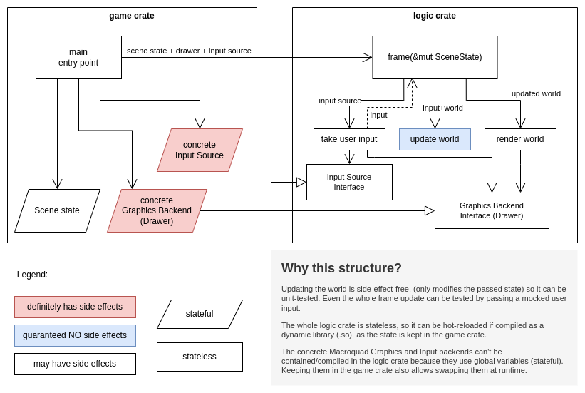

# Bioengineer

[](https://github.com/jmmut/bioengineer/actions)

## Play the game

https://jmmut.itch.io/bioengineer

At the moment you can play in the browser (playable with mouse and keyboard) or download native
versions.

## Compile and run the game

[Install rust](https://www.rust-lang.org/tools/install).

Then, clone the repo:

```
git clone git@github.com:jmmut/bioengineer.git
cd bioengineer
```

and then, simply (`-r` is for compiling in release mode, i.e. with optimizations):

```
cargo run -r
```

That should work in Mac and Linux, and I think Windows too. If this doesn't work, refer
to [the macroquad documentation](https://github.com/not-fl3/macroquad/#linux) or
to [the github actions in this repo](.github/workflows/build.yml) to see how the CI compiles for each platform. You might need to install some
system libraries.

## Architecture of the game



The code is split in 3 crates: `game`, `logic` and `mq_basics`. The main reason to do this is to
support hot reloading.

The entry point is the `game` crate. It's basically the `main() {while frame() {}}` function and
secondary programs like hot_reload_bioengineer. with the initialization of the scenes and the game
loop, but doesn't contain the `frame()` function. If you are starting to look at this repo, you
should start looking at `game/src/main.rs`.

The `logic` crate is a library whose main function `frame()` is for running a single frame. Each
frame has roughly 3 stages: take input (mouse and keyboard), update the world, render the world. The
trick that allows hot reloading is that the frame function takes all the state by mutable
references.

Sadly, the Macroquad functions use a global variable for its context, so no code that uses Macroquad
functions directly can be hot-swapped, because the global variable will be compiled inside the
dynamic library, breaking the idea of keeping all the state in the main function, out of the
library. This would prevent hot-reloading code that, for example, defines and uses some arrangement
of buttons. The only thing I could think of is making
a [`Drawer` interface](logic/src/screen/drawer_trait.rs), and make the frame function take the
interface, whose concrete implementation is defined in `main()`. This also has the benefit that the
graphics backends can be swapped on the fly. At the moment, Macroquad's UI and egui's UI are
supported, but I'll probably remove egui because it's harder to tune.

The `mq_basics` is just some aliases and definitions to make hot reloading possible and clear
without hiding everything behind dynamic interfaces.
